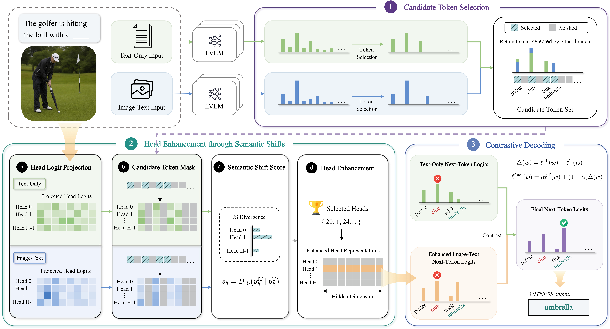

# WITNESS

Code for the paper **"Who Is the Real Witness? Localizing Attention Heads through Image-Induced Semantic Shifts in LVLMs"**

## Overview



## Setup

For Janus-Pro, install the modified Transformers 4.38.2 implementation and the Janus package:

```bash
pip install -e transformers-4.38.2      # reference implementation for Janus-Pro
pip install -e Janus
```

For Llava-NeXT, Qwen2-VL and Qwen3-VL, use the modified Transformers 5.0.0.dev0 implementation:

```bash
pip install -e transformers-5.0.0.dev      # reference implementation for Llava-NeXT, Qwen2-VL and Qwen3-VL
```

Install only the Transformers version corresponding to the model you use. We recommend using separate environments for the two versions.

## Model

Place the Janus-Pro-7B checkpoint under:

```text
models/Janus-Pro-7B/
```

## Datasets

### SynConFact

We provide the **SynConFact** dataset used in our experiments.

Dataset:

```text
https://anonymous-hf.com/a/nxy6sf0rux3k/
```

Place the downloaded files under:

```text
data/SynConFact/
```

SynConFact contains six categories:

```text
animal
attribute
historical
material
object
scene
```

### WHOOPS-AHA!

Download the **WHOOPS-AHA!** dataset from Hugging Face (`francescortu/whoops-aha`) and place the parquet files under:

```text
data/WHOOPS-AHA/
```

Expected structure:

```text
data/WHOOPS-AHA/
├── train-00000-of-00002.parquet
└── train-00001-of-00002.parquet
```

### MME

Download the **MME** benchmark and place the converted parquet files under:

```text
data/MME/
```

Expected structure:

```text
data/MME/
├── test-00000-of-00002.parquet
└── test-00001-of-00002.parquet
```

## Experiments

### Arguments

The released Janus-Pro reference implementation uses the following settings.

| Argument | Example | Description |
| --- | --- | --- |
| `model_path` | `./models/Janus-Pro-7B` | Path to the Janus-Pro-7B checkpoint. |
| `data_dir` | `./data/SynConFact` | Path to the evaluation dataset. |
| `alpha` | `0.4` | Contrastive decoding coefficient. |
| `head_threshold` | `0.8` | Threshold for selecting attention heads according to normalized semantic shift scores. |
| `score_scale` | `1` | Head enhancement coefficient for Janus-Pro. |
| `relative_top` | `0.1` | Relative probability threshold used for candidate token selection. |
| `min_tokens_to_keep` | `10` | Minimum number of candidate tokens retained under each input condition. |
| `max_new_tokens` | `8` | Maximum number of generated tokens. |
| `batch_size` | `1` | Batch size used in the released evaluation scripts. |

### Run SynConFact

```bash
python Janus/janus_pro_synconfact.py
```

### Run WHOOPS-AHA!

```bash
python Janus/janus_pro_whoops_aha.py
```

### Run MME

```bash
python Janus/janus_pro_mme.py
```

After generation, calculate the MME scores with:

```bash
python eval_tool/calculation.py --results_dir ./result/janus_pro_mme/witness_alpha0.4_threshold0.8_scale1
```
